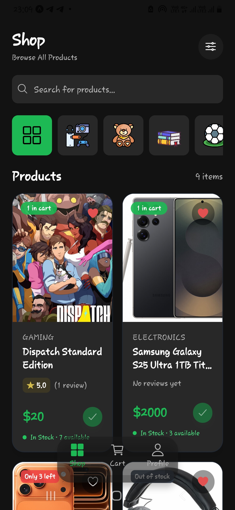
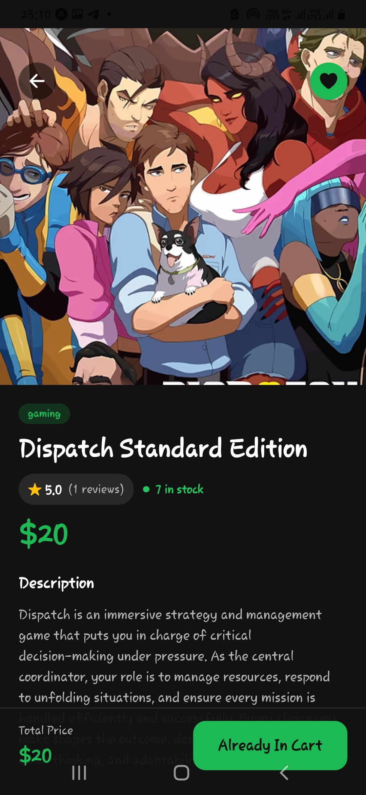
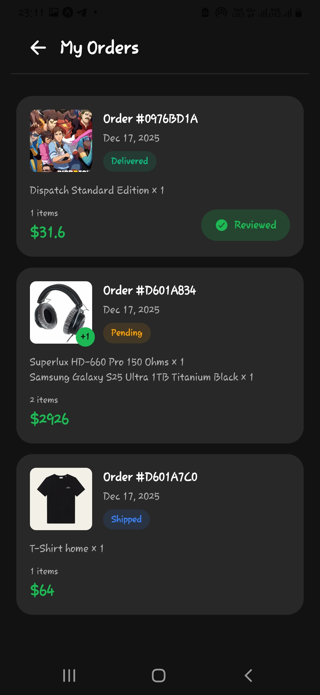
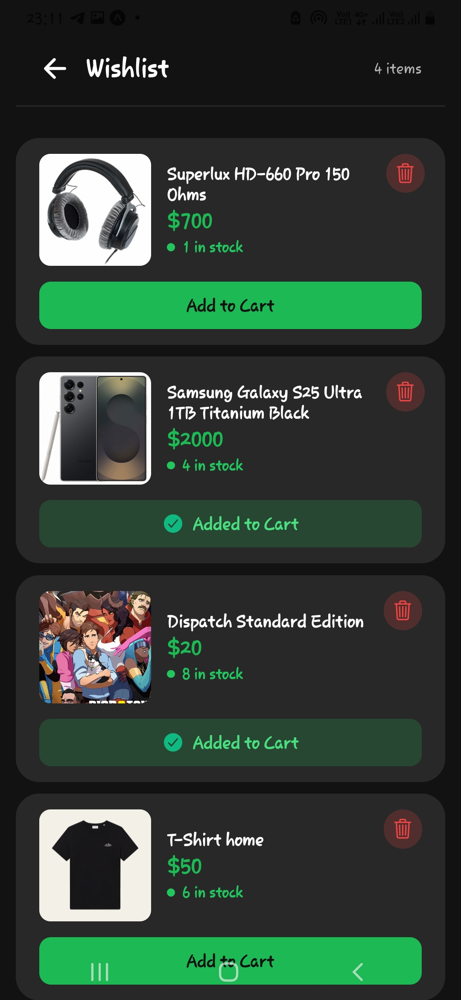
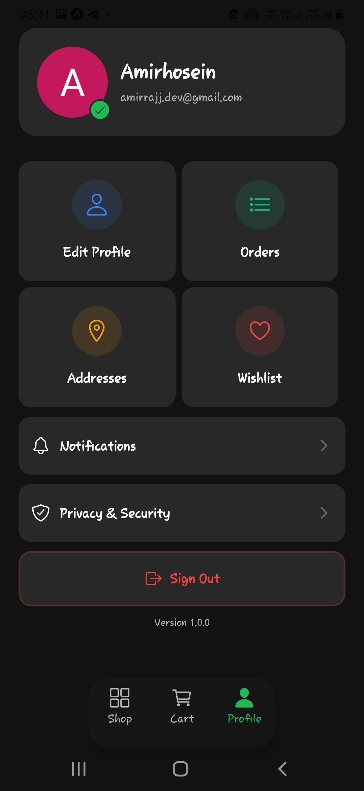
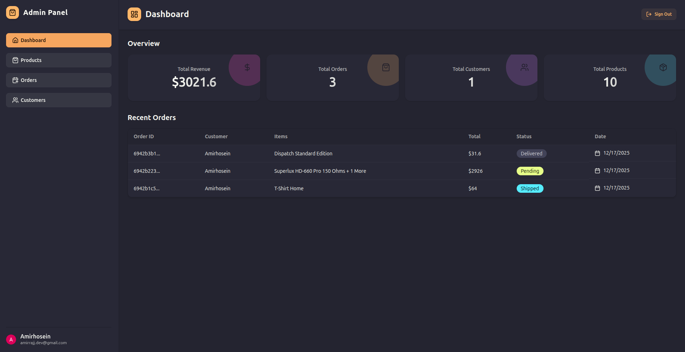
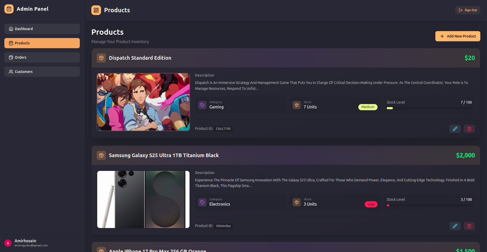
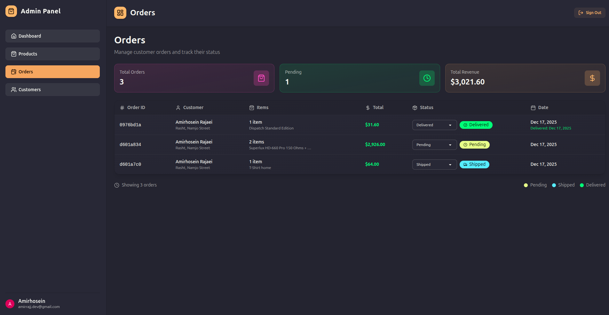
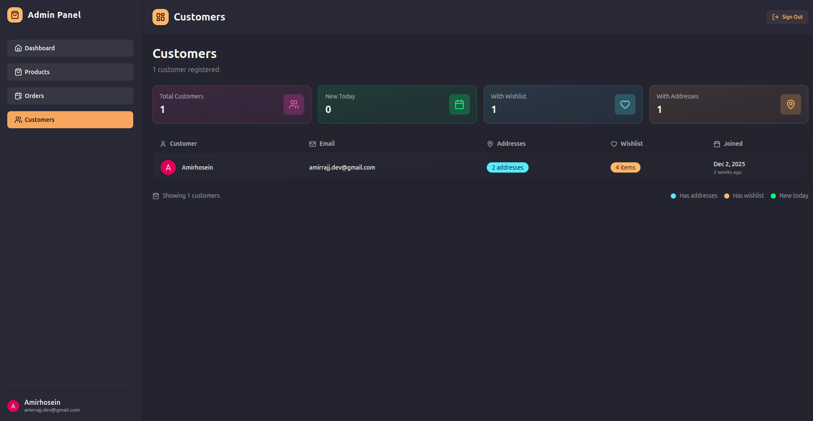

# Full-Stack E-Commerce Platform 🛒📱🧑‍💼

A **production-ready full-stack e-commerce platform** featuring a **mobile shopping app**, a **powerful admin CMS**, and a **scalable backend API**.  
Built with modern technologies, strong architecture, and real-world features like payments, authentication, background jobs, and file uploads.

This project demonstrates **end-to-end system design**, **clean code practices**, and **real e-commerce workflows**.

---

## 📸 Preview

### 📱 Mobile App Screens

| Home | Product | Cart |
|------|--------|------|
|  |  |  |

| Orders | Wishlist | Profile |
|--------|----------|---------|
|  |  |  |

---

### 🧑‍💼 Admin Panel Screens

| Dashboard | Products |
|----------|----------|
|  |  |

| Orders | Customers |
|--------|-----------|
|  |  |

---

## 🧭 Table of Contents
- [Features](#features)
- [Tech Stack](#tech-stack)
- [Environment Setup](#environment-setup)
- [Security & Performance](#security--performance)

---

## ✨ Features

### 🛍️ Customer (Mobile App)
- 🔍 Product browsing, filtering & search  
- 📦 Product details with ratings & reviews  
- 🛒 Shopping cart & quantity management  
- 💳 Secure checkout with **Stripe**  
- 🧾 Order creation & order history  
- ❤️ Wishlist management  
- 🏠 Address management (CRUD)  
- 👤 Profile & account management  
- 🔑 Authentication & session handling with **Clerk**  
- ⚡ Optimistic UI updates for instant feedback  
- 🎨 Smooth UI with **NativeWind (Tailwind for RN)**  
- 🔔 Toast-based success & error feedback  
- 🔄 Pull-to-refresh & loading states  

---

### 🧑‍💼 Admin (CMS)
- 🔐 Secure admin-only authentication  
- 🛡️ Role-based access control  
- 📊 Dashboard analytics & sales stats  
- 📝 Product management (CRUD with image uploads)  
- 🚚 Order management with status updates  
- 👥 Customer management & insights  
- ⚡ Optimistic UI with **TanStack React Query**  
- 🗄️ Server-state caching & background refetching  
- 🖥️ Responsive & accessible UI  
- ⚠️ Error boundaries & loading skeletons  

---

### ⚙️ Backend
- 🏗️ Modular RESTful API with **Express + TypeScript**  
- 🔑 Authentication & role-based authorization  
- 💳 Stripe payment intents & webhook handling  
- 🖼️ Secure file uploads with **Cloudinary**  
- ⚙️ Background jobs & async workflows via **Inngest**  
- 🗃️ Redis caching layer  
- ✉️ Email notifications with **Nodemailer**  
- 📈 Centralized logging with **Winston**  
- 🛡️ Input validation with **Zod**  
- 🚨 Global error handling middleware  
- 🔄 Graceful shutdown & process safety  
- ✅ Health check endpoint for monitoring  


## 🧰 Tech Stack

### 🧠 Core
- **TypeScript**
- **Node.js**
- **Bun**

### 📦 Backend
- Express.js
- MongoDB (Mongoose)
- Redis
- Stripe
- Inngest
- Cloudinary
- Nodemailer
- Zod
- Winston
- Clerk (Auth)

### 🧑‍💼 Admin Panel
- React
- Vite
- Tailwind CSS
- DaisyUI
- TanStack React Query
- Clerk
- Axios

### 📱 Mobile App
- React Native
- Expo
- Expo Router
- NativeWind
- Stripe React Native SDK
- TanStack React Query
- Clerk Expo
- Toast notifications


---

## 🔐 Environment Setup

### Backend (`backend/.env`)
```env
PORT=3000
NODE_ENV=development
LOG_LEVEL=info
DB_URL=mongodb://localhost:27017/ecommerce
REDIS_URL=redis://localhost:6379

CLERK_SECRET_KEY=your_clerk_secret
CLERK_PUBLISHABLE_KEY=your_clerk_publishable_key
STRIPE_SECRET_KEY=your_stripe_secret
STRIPE_WEBHOOK_SECRET=your_webhook_secret
INNGEST_SIGNING_KEY=your_inngest_signin_key

CLOUDINARY_CLOUD_NAME=xxx
CLOUDINARY_API_KEY=xxx
CLOUDINARY_API_SECRET=xxx
CLIENT_URL=http://localhost:5173
```

### Admin (`admin/.env`)
```env
VITE_CLERK_PUBLISHABLE_KEY=your_clerk_key
VITE_API_BASE_URL=http://localhost:3000/api
````

### mobile (`mobile/.env`)
```env
EXPO_PUBLIC_API_URL=http://localhost:3000/api
EXPO_PUBLIC_CLERK_PUBLISHABLE_KEY=your_clerk_key
EXPO_PUBLIC_STRIPE_PUBLISHABLE_KEY=your_stripe_key
```

## 🔒 Security & Performance

- 🛡️ Helmet security headers  
- 👥 Role-based access control (Admin / User)  
- 💳 Stripe webhook signature verification  
- 🚨 Centralized error handling middleware  
- ⚡ Redis caching for improved performance  
- 🗄️ Optimized database queries  
- ⚙️ Background jobs & async workflows with Inngest  


## ❤️ Final Notes

This project is built as a **real-world, production-grade e-commerce system**, not a demo.  
It showcases **scalability**, **clean architecture**, and **modern full-stack development**.

**Built with ❤️ and lots of ☕ by Amirhosein Rajaei**
